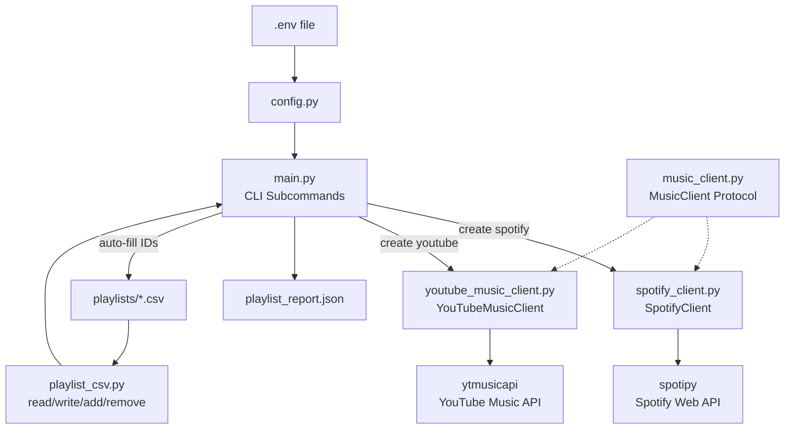
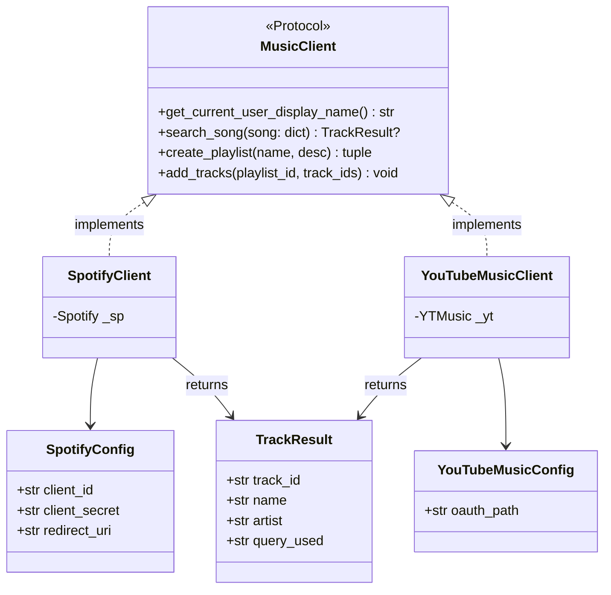
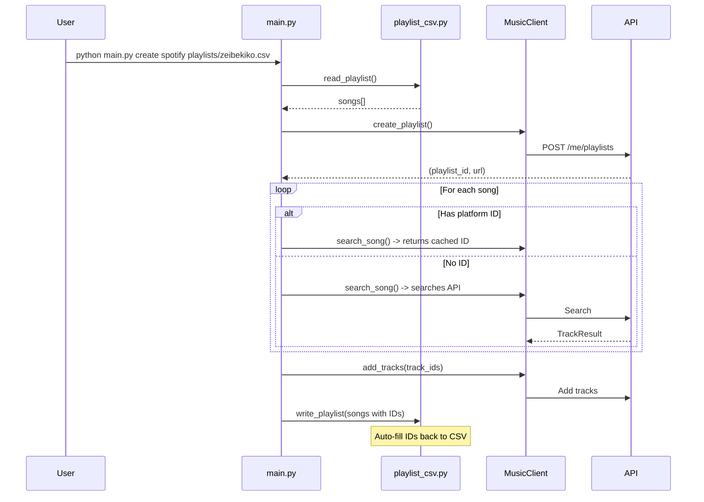

# Architecture

## Component Overview

## Class Diagram

## CLI Flow

## Dependencies

| Package | Purpose |
|---------|---------|
| spotipy | Spotify Web API wrapper |
| ytmusicapi | YouTube Music API wrapper |
| python-dotenv | Load .env credentials |
| pytest | Testing |
